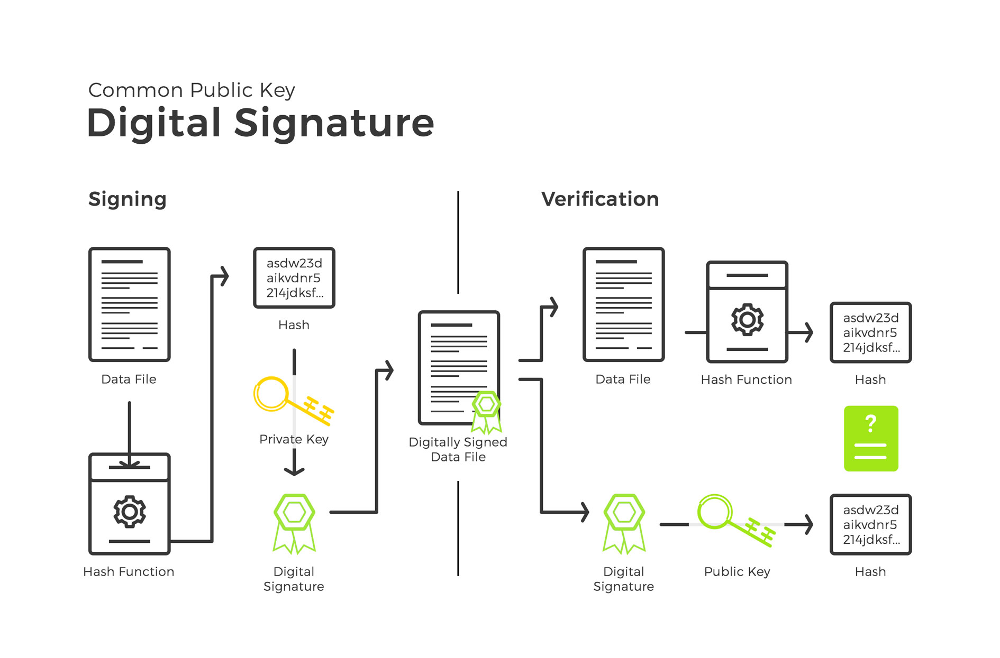

# Firma digitale

## In breve

- generazione di una coppia chiave Privata, chiava Pubblica utilizzando ECDSA e secp256k1
- la chiave privata può firmare `sign()` un messaggio
- la chiave pubblica può verificare che il messaggio sia stato firmato attraverso la chiave privata senza conoscerla `verify(pubKey, hashed_message, signature)`

Nel paragrafo [Transazioni](transazioni.md) viene descritto l'uso della firma digitale in Bitcoin.

## Introduzione

Per comprendere il funzionamento della firma digitale in Bitcoin è necessario prendere confidenza con due argomenti:

- Campi Finiti (Algebra, Teoria dei Gruppi, Teoria dei Numeri, Aritmetica Modulare)
- Curve Ellittiche

La combinazione dei due da luogo alla firma digitale ECDSA.

Benché alcune operazioni non siano intuitive, per comprendere ad alto livello il funzionamento occorrono solo nozioni di base di matematica.
La conoscenza della teoria dei gruppi e dell'analisi matematica costituiscono senza dubbio un valido aiuto per la comprensione.

## Campi Finiti

### premessa

La firma digitale con ECDSA (Elliptic Curve Digital Signature Algorithm) è possibile grazie ai campi finiti.
In particolare grazie all'esistenza del problema del logaritmo discreto che viene qui anticipato e la cui comprensione sarà
più chiara più avanti nel corso del capitolo.

In un campo finito possiamo definire la moltiplicazione di un punto (coppia di coordinate x, y) per una quantità scalare.
Dato un punto G(x, y) e uno scalre s, calcolare la moltiplicazione s G è facile:

P = s G

Ma noti G e P, calcolare la divisione:

s = P / G

è computazionalmente infattibile (nelle opportune condizioni che definiremo).

Ne consegue che se s è una chiave Privata (secreta, secret), e P una chiave Pubblica, non è possibile ricavare il segreto s nota P = s G.

### Artitmetica modulare

L'aritmetica modulare si basa sul concetto di congruenza.

Dati due elementi a e b, si dicono congruenti modulo m se la differenza (a - b) è multipla di m. In tal caso scriveremo:

a ≡ b (mod m)

Ad esempio 17 ≡ 36 (mod 19) perché (36 - 17) = 19

CONTINUA ...

### Il campo delgi interi modulo p

Un campo finito è un insieme finito di elementi.

- ogni campo finito ha p^n elementi, per qualche numero primo p e qualche numero naturale n >= 1.
- per ogni numero primo p e naturale n>=1, esiste un solo campo finito con p^n elementi, a meno di isomorfismo.

## Curve Ellittiche

### SECP256K1

Bitcoin utilizza ECDSA con curva secp256k1.
In futuro potrebbe implementare la firma digitale Schnorr.

## Generazione della chiave privata

Procedure per generare un coppia chiave privata, chiave pubblica:

1. inizializzare la curva ellittica. Nell'esempio si utilizza la curca P256 che è meno sicura della curva secp256k1.

2. utilizzando l'algoritmo ECDSA generate le chiavi. L'algoritmo va alimentato con la curva e un generatore di numero random crittograficamente sicuro.

3. la chiave pubblica viene generata concatendando i valori X e Y

## ECDSA
