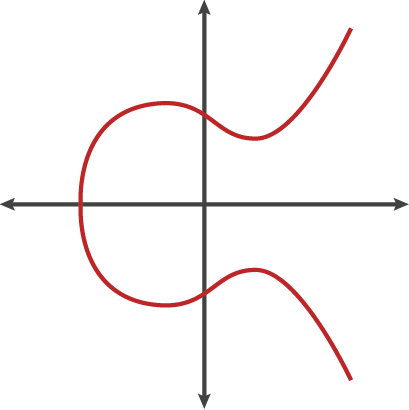

Firma digitale

Introduzione

In Bitcoin la firma digitale Elliptic Curve Digital Signature Algorithm ECDSA è uno degli strumenti fondanti per garantire la sicurezza.

All'interno della comunità di sviluppatori è in corso la discussione circa l'opportunità di estendere Bitcoin anche allo schema [Schnorr](https://en.bitcoin.it/wiki/Schnorr).

Nel prossimo paragrafo tratteremo ECDSA.

La firma digitale consente di firmare “le transazioni” per mezzo di una chiave privata segreta (privateKey). Altri soggetti possono verificare l’autenticità della firma per mezzo di una chiave pubblica (publicKey) associata alla privata per mezzo di relazioni matematiche.

La chiave privata non deve essere disvelata e deve essere custodita con comportamenti sicuri.
La chiave pubblica può essere distribuita senza compromettere la sicurezza. Va però segnalato che la distribuzione della chiave pubblica può comportare una perdita di privacy qualora ciò venga fatto senza accorgimenti volti a tutelare la privacy delle transazioni.

Elliptic Curve Digital Signature Algorithm

Lo schema impiegato ECDSA è basato su ECC *Elliptic Curve Cryptography* con curva ellittica **secp256k1**.

Questa curva ellittica ha equazione:

y^2 = x^3 + 7

Se il dominio di applicazione della curva fosse quello dei numeri reali (ristretto al segmento x | x^3 + 7 >= 0) la curva avrebbe questo aspetto:



è facile comprendere perché sia simmetrica rispetto all'asse x perché suoi punti sono le radici di una cubica:

y = +/- (x^3+7)^(1/2).

In ECC però il dominio della curva non è quello dei numeri reali o interi, ma è un *campo finito* Kp costruito con le classi di resto modulo p, dove p è un numero primo (detto anche campo di Galois).

Gruppo

 Sia G un insieme e ⊥ una operazione binaria interna su G. Diremo che la struttura algebrica (G, ⊥) è un *gruppo* se soddisfa le seguenti proprietà:

- l'operazione interna ⊥ è associativa;
- (G, ⊥) ammette elemento neutro;
- ogni elemento di G è invertibile;

Un gruppo è detto *commutativo* o *abeliano* se soddisfa l'ulteriore proprietà:

- l'operazione interna ⊥ è commutativa;
Classi di resto modulo p
L'aritmetica modulare si basa sul concetto di congruenza.

Dati due numeri interi a e b, si dicono congruente modulo p se la differenza (a - b) è multipla di p. In tal caso scriveremo:

a ≡ b (mod p)

Ad esempio, 

17 ≡ 36 (mod 19) perché (36 - 17) = 19
11 ≡ 49 (mod 19) perché (49 - 11) = 38 = 2 * 19
-1 + 17 (mod 19) = 18
-2 + 17 (mod 19) = 19 (mod 19) = 0
-2 + 18 (mod 19) = 20 (mod 19) = 1

In pratica altro che l'aritmetica dell'orologio alla quale tutti siamo abituati: 23:00 + 2 ore = ore 1:00.
Nel caso dell'orologio il modulo è 12, nel caso dei campi finiti il modulo è un numero primo. Si tratta di una condizione sufficiente ad evitare che esistano divisori dello zero, ma andiamo per gradi.

Per indicare una classe di resto modulo p useremo Zp.

Zp ha delle proprietà interessanti, tali da rendere la struttura algebrica composta da Zp e la somma un gruppo abeliano (o gruppo commutativo):

- proprietà associativa: dati a, b, c appartenenti a Zp, (a + b) + c = a + (b + c)
- esistenza elemento neutro: dato a, l’elemento neutro della somma è lo 0, infatti a + 0 = a
- esistenza elemento inverso della somma: dato a, -a è l’elemento inverso, infatti a + (-a) = 0
- è commutativo: a + b = b + a

Anche la moltiplicazione gode delle stesse proprietà se escludiamo il numero 0 per il quale non esiste l’inverso:

- (a * b) * c = a * (b * c)
- elemento neutro 1
- inverso a^-1 (1/a)
- a * b = b * c

Se con la somma non abbiamo problemi di sorta, con la moltiplicazione, ma soprattutto con la divisione cominciamo ad avere qualche difficoltà intuitiva.

Supponiamo:

11 * 7 = 77 = 4 (mod 19)

Quale è l’elemento inverso di 4? Ovvero quel numero che moltiplicato per 4 da 1? Sappiamo che 4 * 5 = 20 = 1 (mod 19). Dunque, l’elemento inverso è 5, ovvero 4^-1 = 5. Non è molto intuitivo come processo e non è molto pratico andare per tentativi. Immaginiamo con grandi numeri.

Per fare calcoli in maniera “rapida” ci viene in aiuto il piccolo teorema di Fermat:

a^(p-1) = 1 (mod p)

dal quale, moltiplicando ambo i membri per a^(-1):

a^(-1) = a^(p-2) (mod p)

dunque, tornando al 4

4^(-1) = 1 / 4 = 4^(19-2) = 4^17 = 17179869184 = 5 (mod 19)

Il teorema funziona, ma già si cominciano ad intravedere problemi computazionali con la divisione nel in Zp.

Mentre moltiplicare è facile, invertire è molto difficile a livello computazionale. Questa difficoltà prende il nome di Problema del logaritmo discreto ed è un cardine fondante della ECDSA.

Campi

Dato un insieme K e due operazioni binarie interne (somma +, prodotto ∘) su K, diremo che la struttura algebrica (K, +, ∘) è un *corpo* se soddisfa:

- (K, +) è un *gruppo abeliano*
- se 0 è l'elemento neutro di (K, +) e K* = K - {0}, allora (K*, ∘) è un *gruppo*;
- il prodotto è distribuitivo rispotto alla somma.

Se, inoltre, (K*, ∘) è abeliano, allora (K, +, ∘) è detto *corpo commutativo* o **campo**.

Campi Finiti

Un campo finito è un insieme finito di elementi.

- ogni campo finito ha p^n elementi, per qualche numero primo p e qualche numero naturale n >= 1.
- per ogni numero primo p e naturale n>=1, esiste un solo campo finito con p^n elementi, a meno di isomorfismo.


un *campo finito* <span>K<inf>p<inf/><sup>n</sup></span> (p è un numero primo e n un numero intero >=1) è un campo che ha un numero finito di elementi tali che:

- Ogni campo finito ha p^n elementi, per qualche numero primo p e qualche numero naturale n con n>= 1
- Per ogni numero primo p e naturale n >= 1, esiste un solo campo finito con p^n elementi, a meno di isomorfismo.


I **Campi Finiti** K<inf>p</inf><sup>n</sup> sono delle strutture algebriche composte (per n=1) da:

- l'insieme delle classi di resto modulo p (Zp o Z/Zp)
- due operazioni binarie interne: la somma e la moltiplicazione
Nel caso ECDSA il modulo è un numero primo p che, come si evince dal nome della curva stessa (secp256k) è un numero 256 bit che ha valore:

p = 2^256 – 2^32 – 977 = 115792089237316195423570985008687907852837564279074904382605163141518161494337

è prossimo a 2^256, benché non sia il numero primo più grande nell'intervallo 2^256.

Il generatore G è un punto su prodotto cartesiano Kp * Kp di coordinate:

x = 55066263022277343669578718895168534326250603453777594175500187360389116729240,
y = 32670510020758816978083085130507043184471273380659243275938904335757337482424


La firma digitale con ECDSA (Elliptic Curve Digital Signature Algorithm) è possibile grazie ai campi finiti.
In particolare, grazie all'esistenza del problema del logaritmo discreto che viene qui anticipato e la cui comprensione sarà più chiara più avanti nel corso del capitolo.

In un campo finito possiamo definire la moltiplicazione di un punto (coppia di coordinate x, y) per una quantità scalare.
Dato un punto G(x, y) e uno scalre s, calcolare la moltiplicazione s G è facile:

P = s G

Ma noti G e P, calcolare la divisione:

s = P / G

è infattibile a livello computazionale (nelle opportune condizioni che definiremo).

Ne consegue che se s è una chiave Privata (secreta, secret), e P una chiave Pubblica, non è possibile ricavare il segreto s nota P = s G.
 
In ECDSA firmare digitalmente un messaggio M significa applicare una funzione `Sign` che a partire dal codice di hash del messaggio M genera una coppia di numeri interi r e s.

La funzione ha questa forma:

```go
func Sign(rand io.Reader, priv *PrivateKey, hash []byte) (r, s *big.Int, err error) {
  //...
}
```

fa uso di un generatore di numeri random, del puntatore a una chiave privata `PrivateKey` e, ovviamente, del codice di hash di M.

La sicurezza della firma dipende da molti fattori, non ultima l'entropia del generatore di numeri random.

Il generatore di numeri random produce un numero k nell'intervallo [1, p-1].

- Questo numero viene utilizzato per ricavare un punto random R = k * G sulla curva, r = R.x
- s = k^-1 * (h + r * privKey) (mod p) => s * k = h + r * PrivKey
- ritorna r, s

The private key is a random integer chosen from  (where  is the order of the subgroup).
The public key is the point where  is the base point of the subgroup).


- generazione di una coppia chiave Privata, chiava Pubblica utilizzando ECDSA e secp256k1
- la chiave privata può firmare `sign()` un messaggio
- la chiave pubblica può verificare che il messaggio sia stato firmato attraverso la chiave privata senza conoscerla `verify(pubKey, hashed_message, signature)`

Nel paragrafo [Transazioni](transazioni.md) viene descritto l'uso della firma digitale in Bitcoin.

Per comprendere il funzionamento della firma digitale in Bitcoin è necessario prendere confidenza con due argomenti:

- Campi Finiti (Algebra, Teoria dei Gruppi, Teoria dei Numeri, Aritmetica Modulare)
- Curve Ellittiche

La combinazione dei due da luogo alla firma digitale ECDSA.

Benché alcune operazioni non siano intuitive, per comprendere ad alto livello il funzionamento occorrono solo nozioni di base di matematica.
La conoscenza della teoria dei gruppi e dell'analisi matematica costituiscono senza dubbio un valido aiuto per la comprensione.

Sapere le proprietà algebriche dei campi ci permette di comprendere la firma digitale.
