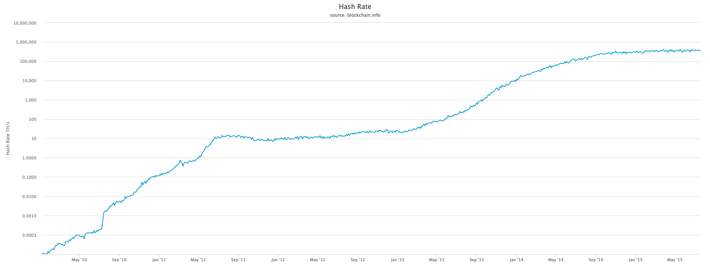

# Miner

## Hash rate

- [What to mine](https://whattomine.com/asic?utf8=%E2%9C%93&sha256f=true&factor%5Bsha256_hr%5D=70000.0&factor%5Bsha256_p%5D=2100.0&factor%5Bscrypt_hash_rate%5D=1240.0&factor%5Bscrypt_power%5D=1500.0&factor%5Bx11_hr%5D=360000.0&factor%5Bx11_p%5D=3000.0&factor%5Bsia_hr%5D=730.0&factor%5Bsia_p%5D=600.0&factor%5Bqk_hr%5D=56000.0&factor%5Bqk_p%5D=1600.0&factor%5Bqb_hr%5D=56000.0&factor%5Bqb_p%5D=1700.0&factor%5Bmg_hr%5D=56.0&factor%5Bmg_p%5D=700.0&factor%5Bsk_hr%5D=28.0&factor%5Bsk_p%5D=600.0&factor%5Blbry_hr%5D=210.0&factor%5Blbry_p%5D=3300.0&factor%5Bbk14_hr%5D=29000.0&factor%5Bbk14_p%5D=1470.0&factor%5Bx11g_hr%5D=7.0&factor%5Bx11g_p%5D=900.0&factor%5Bcn_hr%5D=360.0&factor%5Bcn_p%5D=720.0&factor%5Beq_hr%5D=210.0&factor%5Beq_p%5D=2330.0&factor%5Blrev2_hr%5D=17.2&factor%5Blrev2_p%5D=1470.0&factor%5Bbcd_hr%5D=185.0&factor%5Bbcd_p%5D=670.0&factor%5Bl2z_hr%5D=62.0&factor%5Bl2z_p%5D=670.0&factor%5Bphi_hr%5D=310.0&factor%5Bphi_p%5D=670.0&factor%5Bkec_hr%5D=29.0&factor%5Bkec_p%5D=430.0&factor%5Bgro_hr%5D=56.0&factor%5Bgro_p%5D=900.0&factor%5Bcost%5D=0.15&sort=Profitability24&volume=0&revenue=24h&factor%5Bexchanges%5D%5B%5D=&factor%5Bexchanges%5D%5B%5D=binance&factor%5Bexchanges%5D%5B%5D=bitfinex&factor%5Bexchanges%5D%5B%5D=bitforex&factor%5Bexchanges%5D%5B%5D=bittrex&factor%5Bexchanges%5D%5B%5D=dove&factor%5Bexchanges%5D%5B%5D=exmo&factor%5Bexchanges%5D%5B%5D=gate&factor%5Bexchanges%5D%5B%5D=graviex&factor%5Bexchanges%5D%5B%5D=hitbtc&factor%5Bexchanges%5D%5B%5D=hotbit&factor%5Bexchanges%5D%5B%5D=ogre&factor%5Bexchanges%5D%5B%5D=poloniex&factor%5Bexchanges%5D%5B%5D=stex&dataset=Main&commit=Calculate)

- [Antminer S17+ 73TH/s](https://shop.bitmain.com/product/detail?pid=00020191009185042288l4ol3pU606A5)

- [Grafico Hash Rate](https://www.blockchain.com/en/charts/hash-rate?scale=1&timespan=all)