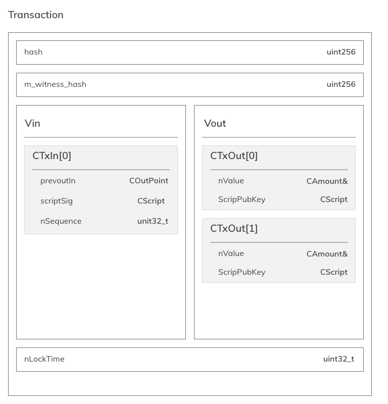

# Transazioni

## UTXO

Un UTXO è un output spendibile di una transazione valida. Nel modello Bitcoin, per spendere un UTXO occorre:

- referenziare l'UTXO in un ingresso `CTxIn` della transazione .
(la referenza è la coppia `COutPoint` composta dal riferimento alla transazione che continete l'UTXO e l'indice del medesimo all'interno di `Vout`),

- fornire lo `scriptSig` * che sblocca lo `scriptPubKey` dell'UTXO.

Nella forma più semplice di `scriptPubKey` (Pay-to-Public-Key-Hash: P2PKH) lo `scriptSig` si compone di due campi:

- la firma di tutta la transazione <sig> (in verità una forma semplificata della transazione).
- la chiave pubblica del destinatario dell'UTXO \<pubKey> con la quale verificare la firma <sig>

poiché:

- la validità dell'UTXO può essere verificata, (è appartenente ad una transazione di un blocco valido e non è stato mai speso) 
- e l'UTXO ha un `scriptPubKey` che "comunica il legittimo proprietario":

fornendo lo `scriptSig` in `CTxIn` e firmando la transazione con la chiave Privata `privateKey` è possibile verificare che il destinatario dell'UTXO è l'unico in grado di fornire una firma valida (attraverso la chiave privata) associata alla chiave pubblica dell'UTXO.

Nel nostro codice la firma  della transazione `txn.Sign(privKey)` va posta su tutti i `CTxIn` che compongono i `Vin` della transazione,
lo `scriptSig` è composto dalla coppia: (`PubKey`, `Signature`) e la `scripBubKey` è la `PubKeyHash`.
